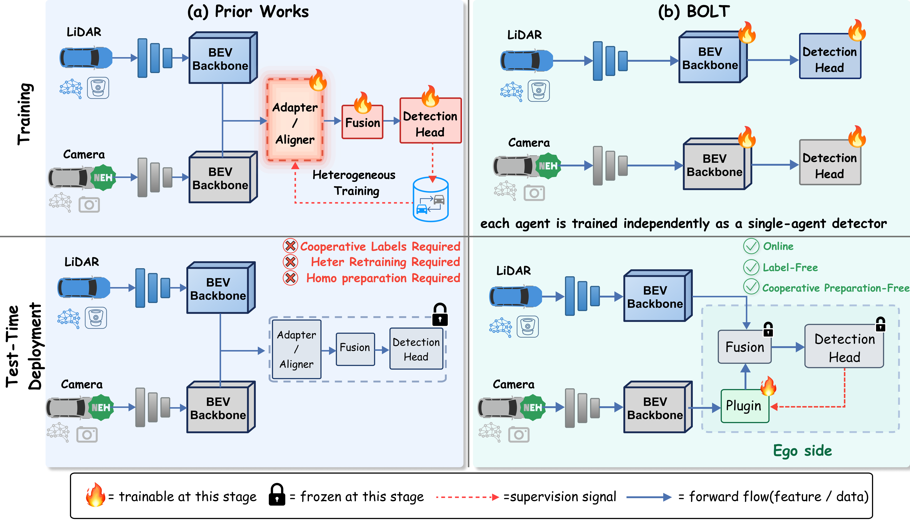
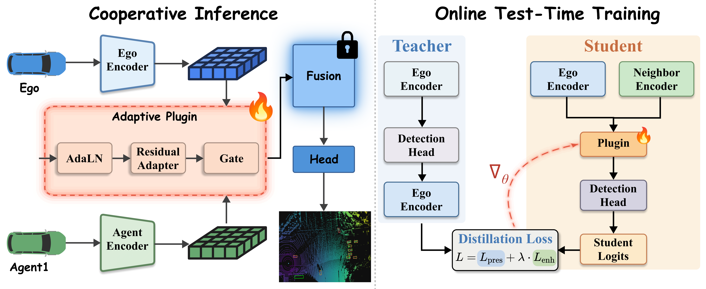
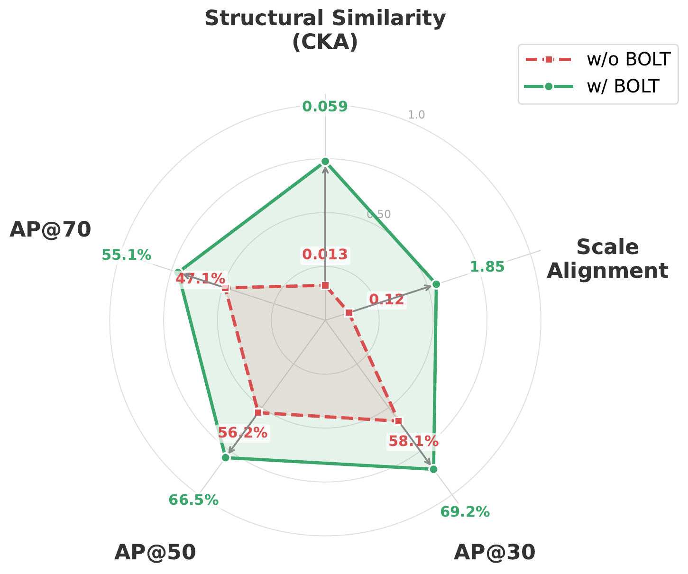
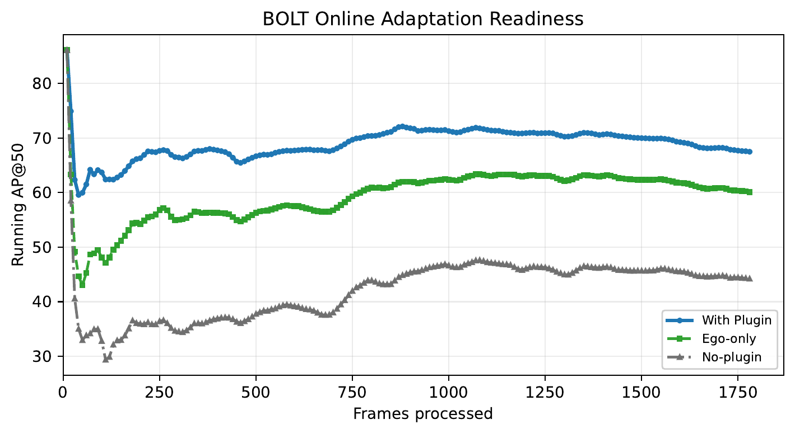
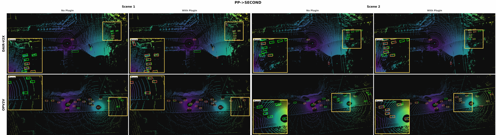

<div align="center">

# 🚦 BOLT
### Base-free Online Lightweight Adaptation<br/>for Preparation-Free Heterogeneous Cooperative Perception

<!-- Badges: replace ARXIV_ID after the arXiv upload -->
[](https://arxiv.org/abs/ARXIV_ID)
[](#-news)
[](LICENSE)
[](https://www.python.org/)
[](https://pytorch.org/)
[](https://github.com/sidiangongyuan/BOLT)

<p align="center"><b>
Drop a ~0.9M-parameter plugin between your detector and a stranger's detector,<br/>
adapt it on the fly with the ego's own predictions, and recover useful cooperation<br/>
without any pre-deployment joint training, without any labels, and without any cooperative data.
</b></p>

<p align="center">
  
</p>

</div>

---

## 📰 News

- **2026-05** &nbsp; Paper submitted to a peer-reviewed venue.
- **2026-05** &nbsp; **Code is publicly released** 🎉
- **2026-05** &nbsp; arXiv preprint will be linked here once the ID is assigned.

---

## ✨ TL;DR

Most "heterogeneous cooperative perception" methods assume that all agents pre-train *together* — shared protocols, joint optimization, or collaborator-specific calibration data. **This breaks the moment two agents from different vendors meet on the road.**

**BOLT** assumes nothing of the sort. Each agent ships with its own independently trained single-agent detector. When two agents meet, BOLT inserts a tiny adaptive plugin between the *neighbor's* feature stream and the *ego's* frozen fusion module, and adapts the plugin **online** via **ego-as-teacher distillation**. No labels. No cooperative training data. No shared protocol.

<p align="center">
  
</p>

Across **DAIR-V2X** and **OPV2V**, with multiple LiDAR/camera encoder pairs and multiple fusion strategies, BOLT consistently turns degraded preparation-free cooperation into useful cooperation that **surpasses ego-only performance**.

---

## ✅ Highlights

| | Feature | Description |
|---|---|---|
| 1 | 🆓 **Preparation-free** | Each agent uses its own independently trained detector. No joint training. No shared protocol. |
| 2 | 🔄 **Online adaptation** | Plugin parameters are updated at deployment by single-pass test-time distillation. |
| 3 | 🪶 **Lightweight** | About **0.9M trainable parameters**. Encoders, fusion module, and detection head are all frozen. |
| 4 | 🏷️ **Label-free, data-free** | Ego predictions act as teacher — no labels, no cooperative training data. |
| 5 | 🧩 **Plug-and-play** | Works across PointPillars / SECOND / Lift-Splat-Shoot encoders and across multiple fusion strategies. |

---

## 📊 Results

Evaluated on **DAIR-V2X** (real V2I) and **OPV2V** (simulated V2V).

In the preparation-free setting, vanilla unadapted fusion typically falls *below* ego-only detection — cooperation actively *hurts*. BOLT reverses this:

- 🚀 Up to **+32.3 AP@50** over unadapted fusion in the preparation-free setting.
- 📈 **Surpasses ego-only** on every evaluated encoder pair across DAIR-V2X and OPV2V.
- 🪶 Trains only **~0.9M parameters** per plugin.

<p align="center">
  
  &nbsp;&nbsp;
  
</p>
<p align="center"><sub>
  <b>Left:</b> performance across encoder pairs — vanilla fusion (red) drops below ego-only, BOLT (blue) consistently surpasses it.
  &nbsp;&nbsp;
  <b>Right:</b> AP@50 improves online as more frames stream in.
</sub></p>

### Qualitative BEV — with vs. without BOLT

<p align="center">
  
</p>
<p align="center"><sub>
  Each pair shares the same scene; the left tile uses vanilla cross-agent fusion, the right tile uses BOLT.
  Green = ground truth, red = predictions. Without BOLT, fused predictions drift, duplicate, or miss objects in the neighbor's view; with BOLT, predictions snap back onto the true objects.
</sub></p>

See the paper for full tables, ablations, and additional qualitative results.

---

## ⚙️ Installation

```bash
git clone https://github.com/sidiangongyuan/BOLT.git
cd BOLT

# Conda env
conda create -n bolt python=3.8 pytorch==1.12.0 torchvision==0.13.0 cudatoolkit=11.6 \
  -c pytorch -c conda-forge
conda activate bolt

# Python packages
pip install -r requirements.txt
pip install spconv-cu116                 # match your CUDA version

# Project-local extensions
python setup.py develop
python opencood/utils/setup.py build_ext --inplace
```

> The codebase reuses some infrastructure from [HEAL](https://github.com/yifanlu0227/HEAL) and [OpenCOOD](https://github.com/DerrickXuNu/OpenCOOD); if you run into platform-specific issues with `spconv` / `cumm`, those repos' troubleshooting tips also apply here.

---

## 📦 Data Preparation

We evaluate on the following datasets:

| Dataset | Used | Source |
|---|---|---|
| **DAIR-V2X-C** | ✅ | [DAIR-V2X](https://thudair.baai.ac.cn/index) with [complemented annotations](https://siheng-chen.github.io/dataset/dair-v2x-c-complemented/) |
| **OPV2V** | ✅ | [OpenCOOD](https://github.com/DerrickXuNu/OpenCOOD) (also `additional-001.zip` for camera) |
| **OPV2V-H** | ⏳ TODO | [Hugging Face](https://huggingface.co/datasets/yifanlu0227/OPV2V-H) — not used in this work; planned for future support. |
| **V2X-Real** | ⏳ TODO | [Official site](https://mobility-lab.seas.ucla.edu/v2x-real/) — not used in this work; planned for future support. |

Each dataset's directory layout is configured through the YAML files under [`opencood/hypes_yaml/`](opencood/hypes_yaml/). Update the dataset paths there before training or inference.

---

## 🚀 Quick Start

BOLT's deployment-time contribution is a single command: a frozen detector pair plus an online-adapted plugin. Before running it, you need a trained base model (single-agent detectors and a fused backbone). The minimal reproducible flow is:

### Step 1 — Train your single-agent detectors

Train one detector per modality / encoder using your own data. Configs are under `opencood/hypes_yaml/`:

```bash
python -m opencood.tools.train \
  -y opencood/hypes_yaml/dairv2x/HEAL/lidar_pyramid_local.yaml
```

Repeat for each agent's modality (e.g., LiDAR PointPillars, LiDAR SECOND, camera Lift-Splat-Shoot). These detectors are trained **independently** — no cross-agent coordination.

### Step 2 — Build the heterogeneous base checkpoint

Assemble the single-agent encoders into a base model that BOLT will plug into. Encoders, the fusion module, and the detection head will be **frozen** afterwards.

```bash
python -m opencood.tools.train \
  -y opencood/hypes_yaml/dairv2x/HEAL/lidar_pp_second_stage2.yaml \
  --stage1_model_dir <path_to_stage1_checkpoints>
```

### Step 3 — Run BOLT online adaptation 🟢 *(this is BOLT)*

At deployment, the ~0.9M-parameter plugin is the only trainable component. It is updated **online**: one gradient step per incoming test sample, supervised by the ego detector's high-confidence predictions (no labels, no cooperative training data).

```bash
python -m opencood.tools.online_adapt \
  --model_dir <path_to_base_checkpoint> \
  --output_dir <output_path> \
  --lr 1e-4 --epochs 1 \
  --teacher_conf_thresh 0.3 \
  --boost_weight 0.1 --boost_lo 0.1 --boost_hi 0.3
```

### Evaluate

```bash
python -m opencood.tools.inference --model_dir <path_to_checkpoint>
```

For ready-made runners, see [`scripts/inference/inference.sh`](scripts/inference/inference.sh) and the multi-agent demos under [`scripts/more_agents/`](scripts/more_agents/).

---

## 🗂 Project Structure

```
opencood/
├── models/
│   ├── plugin/                       # BOLT adaptive plugin (AdaIN + residual + gate)
│   ├── heter_pyramid_collab.py       # Heterogeneous pyramid model
│   ├── heter_encoders.py             # Multi-modality encoder registry
│   └── fuse_modules/                 # Fusion strategies (pyramid, attention, ...)
├── tools/
│   ├── online_adapt.py               # 🟢 Online TTT with ego-as-teacher distillation
│   ├── train.py                      # Standard training
│   └── inference.py                  # Evaluation
├── hypes_yaml/                       # Configs for DAIR-V2X, OPV2V
└── data_utils/                       # Dataset loaders + pre/post processors

scripts/
├── inference/                        # Off-the-shelf inference
├── train/                            # End-to-end training
└── more_agents/                      # Multi-agent (3+ cars) assembly + adaptation
```

> **Note.** This release contains the minimal code needed to reproduce BOLT's core method. Auxiliary scripts used only for paper-specific ablations, visualization, and analysis are not included; the public release will track only the method itself.

---

## 🙏 Acknowledgements

This codebase is built on top of [**HEAL**](https://github.com/yifanlu0227/HEAL) and [**OpenCOOD**](https://github.com/DerrickXuNu/OpenCOOD). We thank the authors of DAIR-V2X, OPV2V, OPV2V-H, and V2X-Real for releasing the datasets that made this work possible.

---

## 📖 Citation

If you find BOLT useful, please cite:

```bibtex
@article{bolt2026,
  title   = {BOLT: Base-free Online Lightweight Adaptation for Preparation-Free Heterogeneous Cooperative Perception},
  author  = {Yang, Kang and Bu, Tianci and Wang, Peng and Li, Deying and Wang, Yongcai},
  journal = {arXiv preprint 2605.00405},
  year    = {2026}
}
```

*(BibTeX will be updated once the arXiv ID is assigned.)*

---

## 📄 License

Released under the [MIT License](LICENSE).
